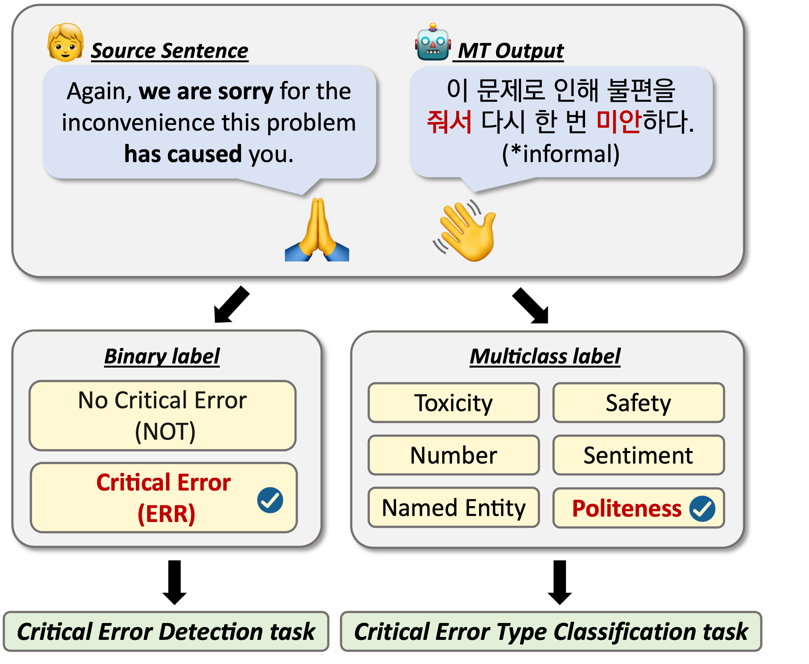

# KNOTICED

This repository contains the KNOTICED dataset.

Paper link: [Detecting Critical Errors Considering Cross-Cultural Factors in English-Korean Translation](https://aclanthology.org/2024.lrec-main.421/)

## Overview

Critical error detection (CED) is a task that identifies an inherent risk of catastrophic meaning distortions in the machine translation (MT) output.
In this paper, we propose KNOTICED, a critical error detection dataset for English-Korean MT. With the importance of reflecting cultural elements in detecting critical errors, KNOTICED newly introduces the culture-aware "Politeness" type. 



## Citation

- Please cite our paper if you use our dataset:
  ```@inproceedings{eo2024detecting,
  title={Detecting Critical Errors Considering Cross-Cultural Factors in English-Korean Translation},
  author={Eo, Sugyeong and Lim, Jungwoo and Park, Chanjun and Jung, Dahyun and Koo, Seonmin and Moon, Hyeonseok and Seo, Jaehyung and Lim, Heui-Seok},
  booktitle={Proceedings of the 2024 Joint International Conference on Computational Linguistics, Language Resources and Evaluation (LREC-COLING 2024)},
  pages={4705--4716},
  year={2024}}
  ```
